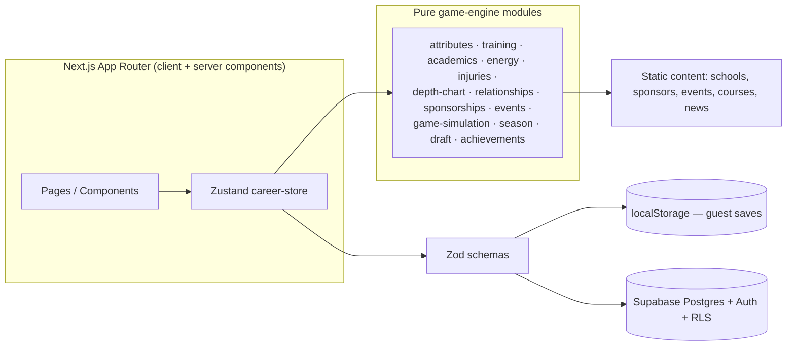

# Campus Legend

**Own the season. Build the legacy.**

A player-career sports RPG built as a portfolio piece. Start as a freshman
college football recruit, train your position, fight for the depth chart,
manage academics and relationships, sign fictional NIL sponsorships, and
chase a fictional professional draft across four college seasons.

> **Everything is fictional.** Every school, conference, athlete, sponsor,
> and headline in Campus Legend is invented for this game. Any resemblance
> to real institutions, leagues, teams, or brands is coincidental. No NCAA,
> NFL, university, or real company trademarks are used.

## Screenshots

_Coming soon — add screenshots of the landing page, career hub, athlete
creation, and a game recap here before publishing._

## Portfolio value

This project exists to demonstrate:

- A **deterministic, testable simulation engine** — seeded RNG, pure
  functions, 84 unit tests covering attribute growth, energy/eligibility
  bounds, depth-chart movement, sponsorship eligibility, draft stock, and
  game simulation.
- A **real game loop**, not a CRUD dashboard — weekly action points with
  tradeoffs, branching story events with delayed consequences, a full
  season/game simulation, and multiple narrative endings.
- **Full-stack TypeScript** with strict typing end-to-end: Zod validation at
  every trust boundary (form input, localStorage, Supabase), Supabase auth +
  Postgres + Row Level Security for cloud saves, Zustand for client game
  state.
- Production-app concerns: accessibility (focus states, reduced-motion,
  aria labeling), responsive mobile-first layout, CI (lint/typecheck/test/
  build), and a clear separation between UI and game rules.

## Feature list

- Freshman-to-senior career across 4 seasons, 5 playable positions (QB, RB,
  WR, LB, CB), each with distinct attributes, training, and game stats.
- Athlete creator with an illustrated avatar builder, difficulty levels, and
  optional deterministic seed.
- 12 fictional schools across 3 conferences, presented as recruiting cards
  with strengths/risks and a projected path to playing time.
- Weekly action-point loop: position training, conditioning, film study,
  tutoring, rest, coach meetings, media, branding, and more — every action
  previews its projected effects (and uncertainty) before you confirm.
- Academics system: courses, study readiness, midterms/finals, GPA,
  eligibility ladder (Eligible → Warning → Probation → Ineligible),
  academic-dismissal ending.
- Depth chart with competing fictional teammates, coach trust, and
  discipline/health-driven movement.
- 46 branching story events across 17 categories (coach conflict, teammate
  rivalry, academic pressure, media, injury recovery, booster pressure,
  transfer opportunities, rule violations, and more) with immediate and
  delayed effects.
- 24 fictional NIL-style sponsors with reputation/following/GPA/personality
  gating, weekly obligations, conflict clauses, and cancellation risk.
- Deterministic, seeded game simulation with position-specific stat lines,
  game-day decisions, performance grades, and media headlines.
- Draft stock tracking, an interactive fictional combine, and 11 possible
  career endings (draft rounds, undrafted, return to school, transfer,
  career-ending injury, academic dismissal, coaching/business paths, and the
  "Campus Legend" ending).
- Guest mode (fully playable, no account, local browser save) and optional
  Supabase-backed cloud saves once configured.

## Architecture overview



**UI never touches engine modules directly.** Every page reads derived state
from `useCareerStore` and calls store actions (`performAction`,
`advanceWeek`, `playGame`, `resolveEvent`, `signSponsor`, `advanceSeason`,
`transferSchool`, `endCareer`, …). The store is the only place that calls
into `src/game-engine/*`, re-normalizes resources through `energy.ts`
(the single source of truth for bounds/eligibility), advances the seeded RNG
cursor, and persists the result. This keeps game rules centralized and the
UI thin — and keeps the engine sport-agnostic at the boundaries (career,
resources, events, academics, sponsorships) so a second sport could be added
without touching auth, progression, or save management.

## Game-engine explanation

Each module in `src/game-engine/` is a set of pure functions operating on
plain data, with a seeded `Rng` (`random.ts`) passed in wherever randomness
is needed — this is what makes the simulation deterministic and unit
testable (same seed + same choices always reproduce the same career).

| Module               | Responsibility                                                                          |
| -------------------- | --------------------------------------------------------------------------------------- |
| `types.ts`           | Single source of truth for every domain type                                            |
| `random.ts`          | Seeded RNG (`Rng`), cursor-based so saves can resume deterministically                  |
| `attributes.ts`      | Position-weighted overall rating, starting-attribute generation                         |
| `progression.ts`     | Attribute growth with diminishing returns + coaching/work-ethic multiplier              |
| `training.ts`        | Weekly action catalog, effect projection, execution (bonus/setback rolls, injury rolls) |
| `academics.ts`       | Exam scoring, GPA conversion, graduation progress                                       |
| `energy.ts`          | The only place resources are clamped; derives eligibility from GPA                      |
| `injuries.ts`        | Injury-risk rolls                                                                       |
| `depth-chart.ts`     | Depth-chart scoring and role assignment from multiple weighted inputs                   |
| `relationships.ts`   | Recurring-character cast and relationship-level helpers                                 |
| `sponsorships.ts`    | Eligibility, weekly payment, deal lifecycle/cancellation                                |
| `events.ts`          | Trigger evaluation, weighted-by-rarity event selection, choice resolution               |
| `game-simulation.ts` | Seeded game sim, game-day decisions, stat-line generation, recap data                   |
| `season.ts`          | Schedule generation, season/phase advancement                                           |
| `draft.ts`           | Draft-stock formula, combine, ending resolution                                         |
| `achievements.ts`    | Achievement/award unlock evaluation                                                     |
| `career.ts`          | Assembles a full `CareerState` from creation input (the one factory function)           |

## Data model summary

Career saves are stored as a single validated `jsonb` blob (the full
`CareerState`) in a `careers` table, with a few denormalized columns
(`school_id`, `position`, `season`, `is_demo`, `updated_at`) for cheap
listing/sorting without deserializing the whole blob. `profiles` holds one
row per authenticated user. Both tables have Row Level Security enabled —
policies restrict every `select`/`insert`/`update`/`delete` to
`auth.uid() = user_id`, so a signed-in user can only ever touch their own
careers. See `supabase/migrations/0001_init.sql` for the full schema,
triggers, and policies.

Guest (local) saves go through the identical Zod validation
(`src/lib/schemas.ts`) before being trusted, so a corrupted or
version-mismatched `localStorage` blob is rejected rather than crashing the
app — same guarantee, no account required.

## Technology choices

| Concern         | Choice                                      | Why                                                                                                  |
| --------------- | ------------------------------------------- | ---------------------------------------------------------------------------------------------------- |
| Framework       | Next.js (App Router) + React 19             | Server components for static/marketing pages, client components only where interaction requires them |
| Language        | TypeScript (strict)                         | Correctness across engine/store/UI boundaries                                                        |
| Styling         | Tailwind CSS + shadcn/ui primitives         | Fast, consistent, themeable design system                                                            |
| State           | Zustand                                     | Minimal client game-session state without boilerplate                                                |
| Validation      | Zod                                         | One schema reused for form input, localStorage, and Supabase                                         |
| Backend         | Supabase (Postgres + Auth + RLS)            | Managed Postgres + auth without running your own backend                                             |
| Charts          | Recharts                                    | Career progression charts                                                                            |
| Motion          | Framer Motion                               | Focused transitions, respects `prefers-reduced-motion`                                               |
| Testing         | Vitest + React Testing Library + Playwright | Unit/component coverage on the engine and UI, e2e on the critical path                               |
| Package manager | pnpm                                        | Fast, disk-efficient installs                                                                        |

## Local setup

```bash
pnpm install
cp .env.example .env.local   # optional — guest mode works with zero config
pnpm dev
```

Open http://localhost:3000. The game is fully playable in **guest mode**
with no environment variables set — guest careers save to `localStorage`.

## Supabase setup (optional — only needed for cloud/account saves)

1. Create a project at [supabase.com](https://supabase.com).
2. Copy your project URL and anon key into `.env.local` (see below).
3. Run the migration: `pnpm db:migrate` (or paste
   `supabase/migrations/0001_init.sql` into the SQL editor).
4. Optionally seed reference content: `pnpm db:seed`.

## Environment variables

See `.env.example` for the full list with inline documentation. Summary:

| Variable                               | Required? | Notes                                                            |
| -------------------------------------- | --------- | ---------------------------------------------------------------- |
| `NEXT_PUBLIC_SUPABASE_URL`             | No        | Enables cloud accounts when set with the anon key                |
| `NEXT_PUBLIC_SUPABASE_ANON_KEY`        | No        | Safe to expose — protected by RLS                                |
| `SUPABASE_SERVICE_ROLE_KEY`            | No        | Server-only, used by seed scripts — never exposed to the browser |
| `NEXT_PUBLIC_ENABLE_CLOUD`             | No        | Force cloud auth UI on/off explicitly                            |
| `E2E_TEST_EMAIL` / `E2E_TEST_PASSWORD` | No        | Only needed for the cloud-save Playwright test                   |

## Migration and seeding commands

```bash
pnpm db:migrate   # supabase db push
pnpm db:seed      # tsx scripts/seed.ts
pnpm db:reset     # supabase db reset
```

## Development commands

```bash
pnpm dev          # start the dev server
pnpm lint         # ESLint
pnpm typecheck    # tsc --noEmit
pnpm format       # Prettier (write)
pnpm format:check # Prettier (check only)
```

## Testing commands

```bash
pnpm test           # Vitest unit/component tests
pnpm test:watch     # Vitest watch mode
pnpm test:coverage  # Vitest with coverage
pnpm test:e2e       # Playwright critical-path e2e
pnpm test:e2e:ui    # Playwright UI mode
```

## Production build

```bash
pnpm build
pnpm start
```

## Deployment (Vercel)

1. Push this repo to GitHub (see below if you haven't yet).
2. Import the repo at [vercel.com/new](https://vercel.com/new).
3. Add the Supabase environment variables (if using cloud saves) in the
   Vercel project settings.
4. Deploy — no other configuration needed; `next build` is the default
   build command Vercel detects automatically.

## GitHub repository commands

If you're setting this up fresh and don't have the GitHub CLI authenticated:

```bash
git init -b main
git add -A
git commit -m "Initial commit"
gh repo create campus-legend --public --source=. --remote=origin --push
# or, without gh:
# 1. Create a new empty repo named "campus-legend" on github.com
# 2. git remote add origin https://github.com/<you>/campus-legend.git
# 3. git push -u origin main
```

## Performance targets

- Route-level loading states on data-driven pages.
- Minimal client-side JavaScript: server components for static content
  (landing sections), client components only where state/interaction is
  required (forms, the career store, game-day decisions).
- Static game-definition content (schools/sponsors/events/courses) is
  imported as plain TypeScript modules — no runtime fetch needed for
  reference data.
- Bundle analysis: `ANALYZE=true pnpm build` (wired via `next.config.ts`).
- Lighthouse: run `pnpm build && pnpm start`, then audit
  `http://localhost:3000` in Chrome DevTools → Lighthouse, targeting 90+ on
  Performance/Accessibility/Best Practices for the landing page.

## Accessibility decisions

- Visible focus rings (`.focus-ring` utility) on every interactive element.
- A skip-to-content link on every page.
- Semantic headings and labeled form fields throughout (react-hook-form +
  `<Label>` pairing).
- `role="meter"` + `aria-valuenow/min/max` on stat bars.
- `prefers-reduced-motion` respected globally (`globals.css`) and explicitly
  in Framer Motion components (`useReducedMotion`).
- Accessible dialogs (Radix UI primitives) for story events and modals.

## Security decisions

- All user input validated with Zod before it touches game state or storage.
- Supabase Row Level Security scopes every career row to its owning user —
  verified in `supabase/migrations/0001_init.sql`; a user cannot read or
  write another user's career via the anon client no matter what ID they
  send.
- The Supabase service-role key is never imported into any client component
  or bundled to the browser — only used server-side in seed scripts.
- No secrets committed; `.env.local` is gitignored, `.env.example` documents
  every variable without real values.
- No `dangerouslySetInnerHTML` / unsafe HTML rendering anywhere in the app.
- Run `pnpm audit` periodically to check for known-vulnerable dependencies.
  Next.js was pinned to 15.1.6 during development, which carried two critical
  advisories (RCE via the React Flight protocol and a middleware
  authorization bypass); this repo has been bumped to 15.5.21, which patches
  both. The remaining `pnpm audit` findings are all in the Vitest/Vite dev
  toolchain (test-runner only, never shipped to users) — worth watching, not
  urgent.
- Two unused Radix dependencies (`@radix-ui/react-toast`,
  `@radix-ui/react-tooltip`) were removed — the toast system here is a small
  custom Zustand-backed implementation, not built on Radix.

## Known limitations

- Save schema is a single validated JSON blob rather than a fully
  normalized relational schema — a deliberate MVP tradeoff; see
  `PROJECT_STATUS.md` for the full list of scope decisions.
- One exam cycle per season (midterm + final), not separate Fall/Spring
  terms.
- Game-day decisions draw from a small fixed pool rather than per-position
  content.
- No real-time multiplayer, no licensed sports data, no external sports
  APIs — by design (see the original scope constraints).

## Future roadmap

- A second playable sport, using the same sport-agnostic career/resources/
  events/academics/sponsorships boundaries.
- Deeper depth-chart rival storylines tied to specific competitors by name.
- More granular per-position game-day decision content.
- Achievements/awards shareable as an image card (not just text summary).
- Optional light "paper document" theme toggle for the whole app (the CSS
  variables already exist — `.theme-paper` in `globals.css`).

---

Built with Next.js, React, TypeScript, Tailwind CSS, Zustand, Zod, Supabase,
Recharts, and Framer Motion.
